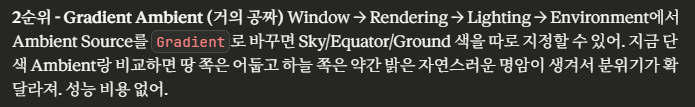
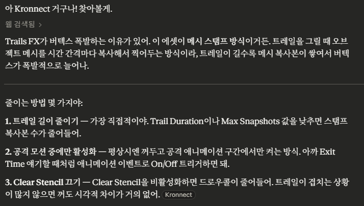
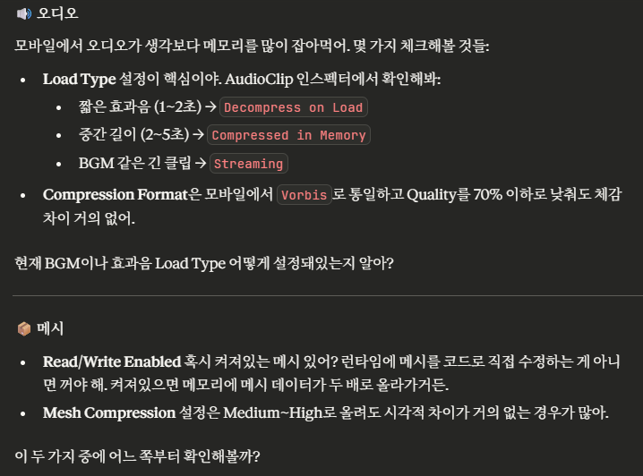
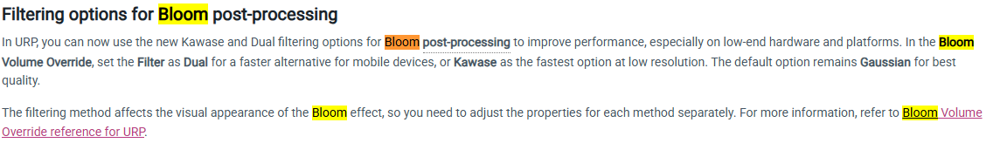

# 3월 1주차 브레인스토밍

컴투스 컴온 최종 발표에 선정되었을 경우의 수.
만약 발표까지 간다? 그럼 크런치 갑니다.

만약 그 전에 아쉽게 떨어진다면.. #2 개발은 스킵하고(아트만 진행)
바로 시스템 개발로 진입합니다.

### #1. 퀄리티업,최적화

**[퀄리티업]**

1. 맵 밀도 향상. 식물,바닥 블록 추가.
   특히 기존 돌 구조물, 절벽 쪽에 바닥 블록 많이 추가해서 디테일 살림.

2. 분위기 잡기

   

   피격효과도 빼자. 패스 늘어나니까. 대신 비네팅이나 ui로 땜빵.

3. Trail도 적용해볼까? 다만, 아래 내용들 명심할 것.
   

**[최적화]**

1. OnDemandRendering으로 120fps 설정 후 40fps 우회 렌더링 트라이.
   만약 이게 안되는 디바이스면 30fps로 설정.
   +만약 이러고 성능 남으면 모션블러 ㄱㄱ 
2. 화질 설정

3. 비네팅 지금은 별도 패스일 것. 만약 Beautify에서 싱글패스로 동작하면 그렇게 하고, 아니면 ui로 넘기자.

4. 오디오,메시 체크

5. 포스트프로세싱 과정 전면 개편
   기존에 beautify가 비효율적이라고 판단.  이렇게 Bloom의 개선이 6.3버전부터 생겼다. beautify + 내장 bloom으로 테스트.

6. 적들에게 붙어있는 OnStateMove를 싹 제거. 그냥 애니메이터의 ExitTime으로 해결.

7. opaque texture를 끄고 해당 파티클을 hit and slashes 파티클로 전환할 예정.
   기억상, 해당 파티클은 머티리얼 수도 2개정도라 굉장히 빠를것으로 생각. 
   (kyeoms사 파티클 테스트 한번 진행해보자. 나쁘지 않으면 적 파티클도 해당 베이스로 옮김)

8. 파티클 간 중첩 문제 해결
   한번에 여러 종의 파티클이 동시 렌더링되지 않도록 코드를 통해 강제 종료.

### #2. 프롤로그 완성

프롤로그, 스토리, 컷씬 포스팅을 참고.

### #3. 시스템 진입 (4월)

아무래도 지금 시스템 작업에 들어가도 3/20일까지 완성하는데는 무리가 있다.
선정된다면 프롤로그까지 작업을 마무리해서 발표 시점에 큰 임팩트를 줄 필요가 있다.