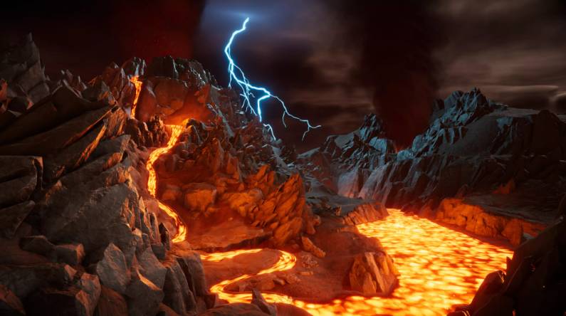

# 프롤로그 스토리, 컷씬

### 스타일

- 3:4 비율의 일러스트.
- 별도의 연출은 넣지 않을 것입니다.
  Only 페이드, 하단 자막 페이드
- 더 좋은 연출 방법이 떠올라도 위 양식에 맞춰주세요.
- 고민이 있는데, 완전 이전에 만든 프롤로그처럼 프레임 하는거 
  어떻게 생각하시는지? + On,Off 쉽나요? + 어렵나요?

### 프롤로그

[#1. 튜토리얼]

용암지대에서 게임 시작. 타이틀에 있는 그 느낌으로 대결을 펼친다.
하지만 전혀 상대가 되지 않고, 적이 포효하면서 컷씬으로 전환(적이 공격하는 타이밍임.)

[#2. 컷씬 전환]

1. 적이 강력한 일격을 날리는 모습 
2. 플레이어 정면에 적이 포효하고 플레이어가 가드 자세. 양 옆으로 엄청난 바람,먼지
3. 2번 일러스트를 조금 더럽게 해서 상황이 심각해지는걸 표현
4. 수 개월 후... (글씨만)