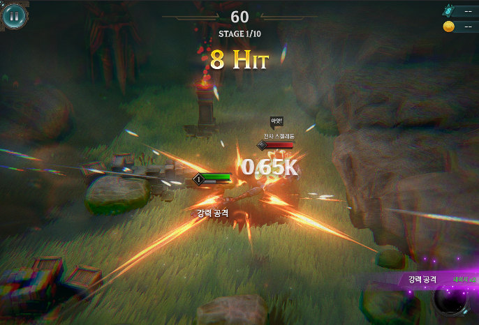
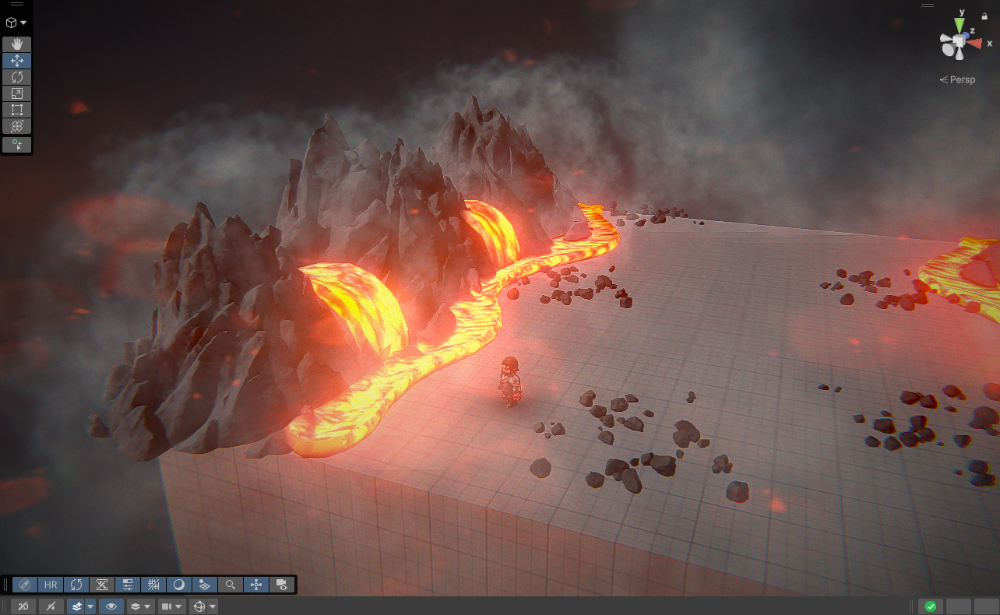

# 26.03 2주차 개발일지

[TOC]

---

### 개발환경 세팅

**[불필요한 프로그램 삭제]**

1. 어도비 계열 전부 삭제.
2. 언리얼 엔진, 에픽 런쳐 전부 삭제 
3. 휴지통 비우기 

**[드라이브 정리]**

1. 폴더 정리
2. APK 업로드 및 정리.

**[깃허브, 클로드 코드 연동]**

1. 깃허브와 [Asset_Important] 폴더 연동
2. 클로드 코드 연동 마무리.

---

### IngameTextBlock

### {: .left w="400" }

### {: .left w="400" }

대충 이런식으로 오른쪽에 공격 상태를 설명해주는 UI를 제작할 것이다.

**[동작 매커니즘 제작]**

- 베이스 매커니즘

  - 기본 공격은 그냥 똑같음
  - 강 공격을 하는 순간 강력 콤보 돌입. 적이 경직되고 데미지 상승.
  - 강력 콤보 도중 또 강 공격을 맞추면 오버히트! 상태가 됨.
    오버 히트 상태는 강 공격으로만 갱신이 가능함.

  ***연속해서 강 공격을 맞춰 오버 히트 상태에 돌입하고,***
  ***강 공격들을 빠르게 연계하여 오버 히트 상태를 유지하는것이 목표.***

- 추가 숙지 사항

  - 일부 긴 연계기의 경우, 오버히트 상태 갱신이 가능함.
    ex) 4타짜리 스킬 콤보같은거. 1타~4타
  - 물론, 가시성 혼란을 주지 않기 위해 별도 UI 애니메이션을 넣지는 않을 것.
    그냥 잘 동작하니까 티 안나게 하려는 의도.

**[ParticleImage 복제 플러그인 제작]**

좀더 동적인 UI를 위해 ParticleImage를 적극 사용하였다.
그 과정에서 클로드 코드에게 기존 파티클을 ParticleImage형식으로 전환해주는
툴 제작을 요청하였다.

가속도 부분은 처리하지 못하지만, 이미지나 시간별 색상, 크기는 잘 변환해준다.
deepcopy로 처리해서 저장 문제도 해결했다. (처음엔 에러가 있었음.)

**[최적화]**

1. 아틀라스를 적용했다. 새로 들어온 ParticleImage, Tmp구조들에 맞춰서 새로 작업해주었다.
2. textblockgroup의 tmp batch를 위해 텍스트를 별도로 그룹화하여 적용해주었다. 

**[액션 매커니즘 조정]**

- 스킬 차지 중에는 TextBlockGroup이 잠시 정지된다.
- TextBlockGroup을 기반으로 데미지, 경직 여부 재설정
- 이후, 적의 실질적인 피격 시스템 리뉴얼
- TrailEffect 넣어보기.

---

### 전투 시퀸스 폴리싱 

1. **공격, 이동(회피)의 경계를 확실히 했다.**

   - 공격 중에는 카메라가 ZoomIn, 각도도 조금 더 꺾어서 역동성을 강조한다.
     비네팅도 강화되어 중심에 집중하는 느낌 연출.
   - 이동 중에는 Zoom Out 되고, 전반적으로 원경을 보여주는 느낌이 강하다.
   - "카이팅" (공격과 이동을 반복하는 과정) 에서 위 2가지 연출이 전환되며 속도감을 강조한다.

2. **화면 밀도 올리기**

   사실, 궁수의 전설 같은 전투에서 더이상 인게임 상 밀도를 올리기는 힘들다고 판단, 
   다른 방식으로 밀도를 높아보이게 했다.

   - UI TextBlockGroup으로 현 공격상태, 추가 데미지 표기. 

   - 무적이나 강력 공격같은 상태를 플레이어 체력바 밑에 글자로 동적 표기

   - UI상 이펙트 적극 사용

     - UI TextBlockGroup의 단계 상승 이펙트
     - 스킬 게이지가 찼을때 특수 이펙트

   - 색수차 + 피사계심도 조합으로 세미 리얼 느낌 극대화.
     특히, 중심과 거리가 있는 부분에서 피사계심도로 블러처리된 개체가 색수차로 인해 색 분리가 일어나는 효과가 상당히 화면을 풍성하게 만들어준다.

     

   - Volumetric 한, 공감간 있는 안개를 써서 세미 리얼 느낌을 강조.

3. **매 순간 선택을 중요시하는 핵심 가치 강조**

   이 게임의 핵심 매커니즘은 이동중 공격 불가, 공격중 이동 불가. 따라서 이 둘을 선택해야 함.
   *(적들이 원거리에서 막 투사체 발사를 하는데 생각없이 공격을 하면, 이동(회피) 타이밍을 뺏김.)*

   1. 연출상의 분리

      - 공격, 회피 간 카메라 각도, 시야, 연출 등을 각각 별도로 두어서
        두 행동 간 명확한 차이를 두었음.

   2. 템포를 낮추고, 연출과 시스템으로 커버

      - 매 순간 선택을 시키려면 동작 속도가 너무 빠르면 안됨. 
        그럼 그냥 막 누르게 됨. 하지만 속도를 늦추면 루즈해짐.
      - 그래서 타격 연출을 보강하여 "묵직한 맛"을 살리고,
        강 공격을 맞출수록 데미지가 x2, x4로 강해지는 시스템을 넣어서 
        한방 한방에(특히 강공격) 더 집중하도록 함.
      - 또한, 이 과정에서 UI Effect를 적극 사용하여, "오, 이 공격은 뭔가 좀 다르네" 를 알수 있게 하였고, 이를 눈치챈 유저가 자세히 바라보면 어떤 효과가 있는지도 알 수 있게 하였음.
        (강력 공격을 하면, 플레이어 체력바 밑에 강력 공격이라고 표시.)
        (타격 시 상태를 오른쪽 탭에 표시, 작은 글씨로 효과도 적어놓음.)

      **그래서 궁수의 전설의 슈팅 감성보다는, 다크소울의 회피 + 철권의 콤보 느낌을 주려고 하였음.**

   

---

### 화산 맵 레벨 디자인

- 진행중. 다만, 4/1 발표에는 안 들어갈꺼임. (그래서 우선순위를 낮췄음.)
- 들어가려면 컷씬 완료 시점에 같이 완성을 해야하는데, 컷씬은 발표 날짜 확정일부터 시작해도 해당 날짜까지 마무리하는것은 힘들것이라고 판단.

### {: .left w="400" }

---

### 발표까지..?

0. 일단 이번 작업으로 플레이어 전투 폴리싱은 끝남.
1. 다음주는 모든 적 폴리싱 + 능력 폴리싱
   - 근거리 공격 중, 적의 패턴이 명확하게 보이도록. 
     간단히 말하면 빨간 줄 같은것으로 적의 투사체 위치를 표시해서 
     직관적으로 보이게.
   - 약간의 이펙트 추가 작업
   - 개편된 전투 시스템에 맞춘 능력 폴리싱
2. 다다음주는 보스 폴리싱 + 최종 마무리
3. 그리고 다다다음주는 발표날 전까지 발표 준비.
