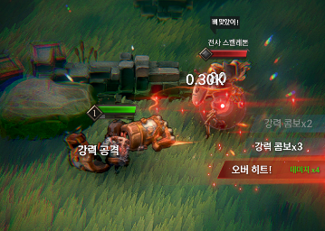
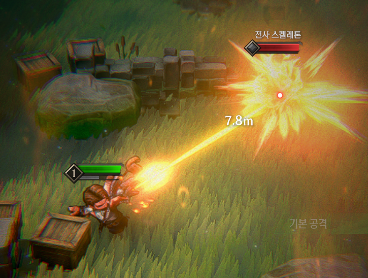

# 26.03 3주차 개발일지

[TOC]

---

### 액션 폴리싱

**[TargetPointer FX]**

{: .left w="400" }

- 생각해보니, 이전 프로토타입에서 사용했던
  텍스트 이펙트가 상당히 좋았다. 게다가 이제 UI상에서 동작하니 선명하고,
  무엇보다 Atlas가 적용되어 드로우콜도 없을 것이다.
  다만, 배칭이 깨지지 않게 하기 위해 약간의 작업을 해야하긴 할 듯.

- 다만, 너무 난잡해져서 이 안건은 파기. 대신, 오버히트 상태를 강조할 필요를 느낌.
  그래서 TargetPointer에 오버히트 상태에서는 추가 효과가 나오도록 설정했다.

**[과한 이펙트 조정]**

1. Killable이펙트는 너무 과해서 삭제했다.

**[적 처치 연출?]**

---

### 무기 제작

**[활 복구]**

{: .left w="400" }

- 활 파티클 머티리얼 최적화를 진행해주었다. 
  SetPassCall 80 후반대에서 60대로 내려왔다. 
- 사용감도 건틀릿과 유사하도록 싹 조정해주었다.
- 활의 컨셉은, 막타 최강 샷건맨이다.
  막타는 어마어마하게 세지만 도달하는데 시간이 걸리고 느리고 후딜도 크다.
  2타까지는 무난하지만 데미지가 살짝 아쉽다. 그래서 2타까지 간보다가 3타 맞추는 컨셉.

**[대검 제작]**

어른의 사정으로 타이틀에 있는 대검이 없는게 참 아쉬웠다.
하나..만들어야겠지?

---

### 특수무기(스킬) 복구

**[초록 검 복구]**

**[붉은 도끼 복구]**
