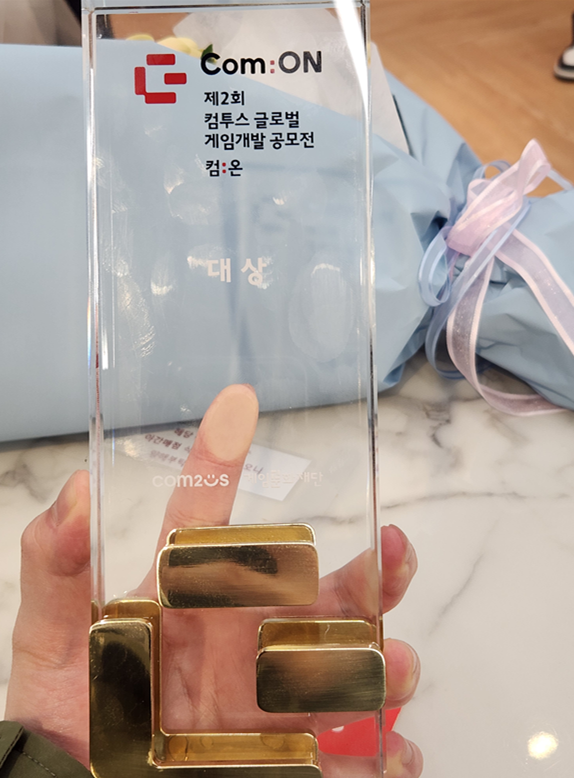

# 26.04 1주차 개발일지

[TOC]

---

### 컴투스 컴:온  마무리 

당당하게 1등으로 마무리했다.

우승자 특전으로,

1. 상금 2000만원 (세전)
2. 대상 수상자는 3년 내 컴투스 공개채용 지원 시 1차 서류전형 통과
3. 컴투스 그룹의 하이브 플랫폼 무상 제공 / 멘토링 기회 제공

서경이가 요청한 수상사항 정리(서경이가 참여한것)

1. 2024 인디크래프트 8위
2. 2024 경기게임아카데미 (경기콘텐츠진흥원 게임 스타트업 지원사업)
   - 기본, 심화, 후속지원 선정
   - 총 지원금 기준으로 최종 1위. 
3. 2025 SW 중심대학 연합 SW 페스티벌 (아주대, 경기대, 경희대) 최우수상 수상. (종합 2위)
   - 게임 부문 1위
4. 제2회 컴투스 글로벌 게임개발 공모전 '컴:온' 대상

---

### 상금 사용 계획

클로드 말에 따르면, 세후 1900언저리가 나온다고 함.

1. 캐릭터 3종 제작 (여캐 + 퍼리 + 미정) = 300 x 3 = 900
2. 제 사비로 사용했던 개발비 = 100 좀 넘을듯. 이건 깔끔하게 정리해서 증빙하겠습니다. 꼭 봐주세요
3. 각자 150씩 = 150 x 2 = 300 (4월)
4. 서경이 월급(5월부터) 월 50씩 = 50 x 6 = 300
5. 로고 외주 = 100
6. 남은 돈 = 200정도. 아마 시연 기기 하나 더 구매 + 각종 시연 물품 + 6개월치 개발비로 쓰면 적절할듯

---

