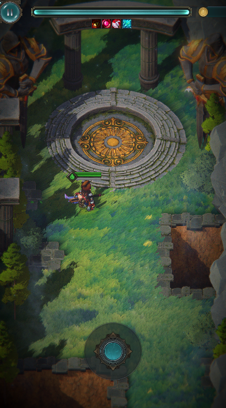

# 26.04 2,3,4주차 개발일지

[TOC]

---

### 고민 문답

컴투스 공모전을 우승한 후 일단 급한 불은 껐다. 아트님과의 계약도 연장하였고, 최소한 후회없이 마무리할만큼의 추가 리소스 외주비도 확보하였다. 이제 남은 공모전은 3개. (G-Star시점에 뭘 한다고 바뀌는건 딱히 없을것 같아서 가장 후순위다. 심지어 이건 돈이 들어감)

1.  인디크래프트 / 05-06(수) 오후 6시 마감
2. 경기게임오디션 / 공모:5월
3. GIGDC / (특이사항: 대학부 대상 = 장관상) 2년간 6월중 접수

사실 규모만 놓고보면 컴투스도 전혀 안밀리지만(오히려 2등정도는 하는듯), 네임밸류만 놓고 보면 저 셋이 3대장인건 맞다. 저기서도 물론 1등할 마음가짐으로 갈 것이다. 하지만 지금 트렌드(PC 선호)와 애매한 완성도 때문에 아무리 봐도 Top3컷일것 같은 느낌이 든다. 

그래서 구국의 결단을 한다. 액션 시스템을 한번 손봐야겠다. + 시작부터 최적화 특화된 아트로 갈 것이다.
하지만 이번엔 혼자가 아니다. 클로드와 함께다.

---

### 이동, 공격

**캐주얼한 "고퀄리티" 모션 컨셉으로 개발하였다.**

1. 기본공격 시, 무기를 Unsheath, 캔슬 시 Sheath 하고, 
   IK와 Leaning Animator를 통하여 절차적 애니메이션으로 제작한다.
   때문에 기본 공격 단에서 모션이 끊기는 일이 없다.
2. Dash 제작
3. 적 통과 가능, But 공격 시 일정거리 유지하도록 코드를 짬.

**hp바, 버스트 공격, hp바 버스트 표시**

1. hp바에 particle image 적용
2. 텍스트는 전부 삭제. 매우 용이하다.

---

### 2,3,4주차??

사실 컴투스 컴온이 끝나고 곧바로 시험기간이 되어버렸다.
과제도 많이 밀렸고...

진짜 힘들어 죽겠다. 쉬지를 못하네!!진짜!!
그런 이유로 2,3,4주차까지는 밀린 숙제, 약간의 시험공부로 인해 프로젝트가 잠깐 쉬어가게 되었다.

그래도 원래 시험공부같은걸 할때 아이디어가 막 떠오르기 때문에, 짬을 내서 작업을 해보았는데, 
진짜 완벽하게 원하는 형태로의 레벨 디자인 + 포스트프로세싱을 완성하였다.

ortho 스타일 야숨이라고 봐도 무방하고 beautify bloom에서 벗어나 
더욱 가벼운 내장 kawase bloom을 사용하였음에도 잘 어울리는 완벽한 조합이다.

시험이 끝나면 빨리 테스트해보아야지..

