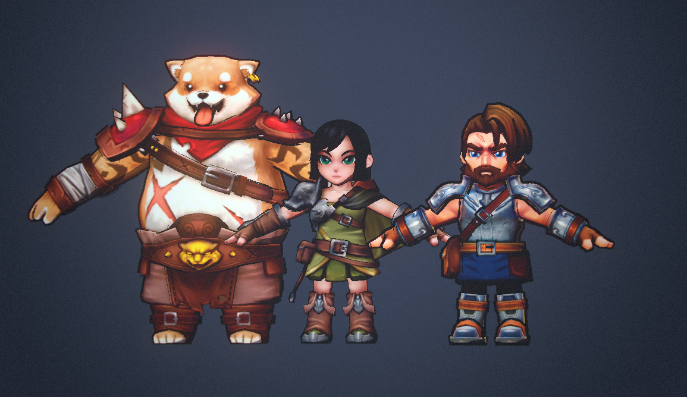
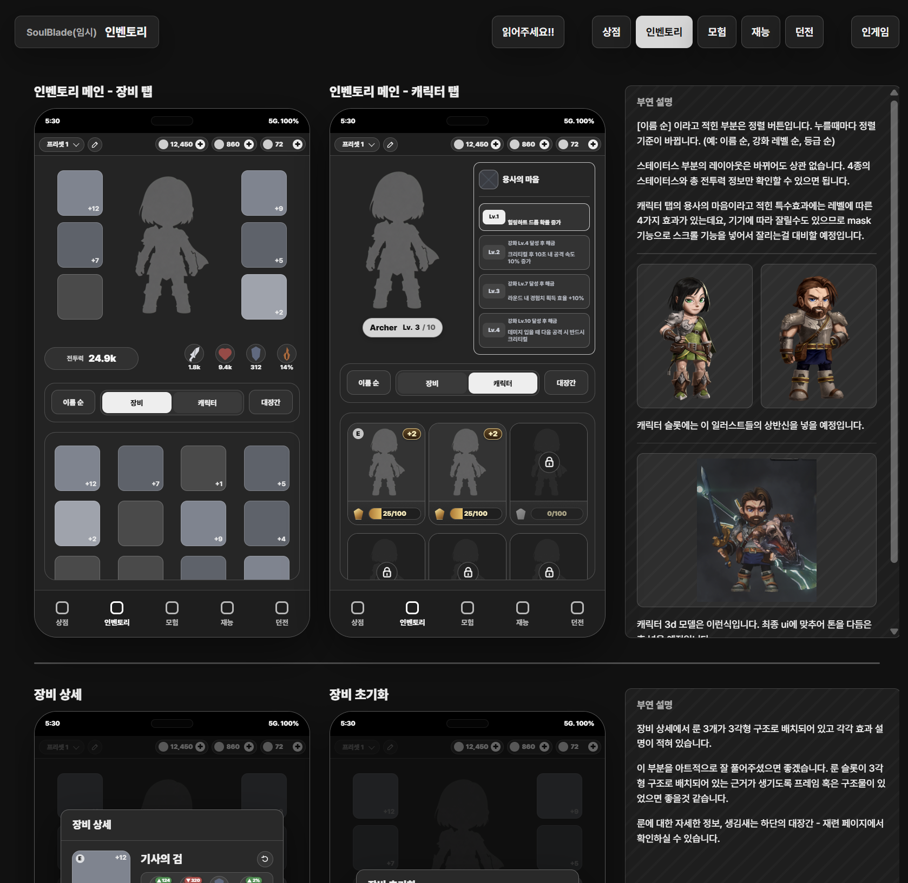
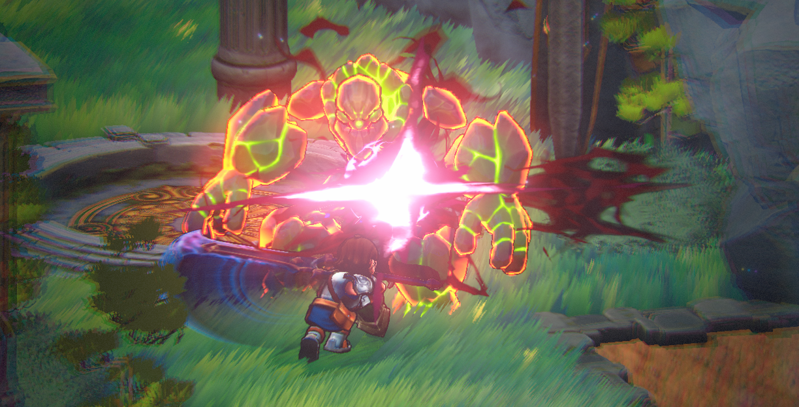
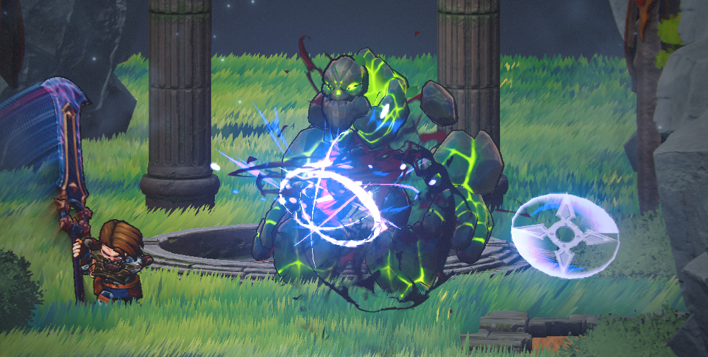

# 26.05 3주차 개발일지

[TOC]

---

### 너무 바빴다!

일지를 거의 1달정도 놓고 있었는데, 너무 일들이 많았다. 각종 학교 일들도 그렇고, 각종 외주 의뢰들 처리.. 큰 돈을 잘 사용하려다 보니까 개발 이상으로 시간이 많이 들어갔다.

그런데 사실 개발비 집행하는걸 일지로 쓰기엔 좀 애매맨이잖아요? 그래서 일지를 좀 못 쓰게 되었습니다. 
사실 아직도 바쁘다. 슬슬 숨통이 트이는데 또 기말고사 시즌이기 때문이다. 물론 공부는 안하면 되지만 학기말이라 과제들도 점점 많아지기 때문에 ㅋㅋ 갑작스럽게 쓰지 못할수도 있겠다는 생각이 든다.

그래도 얼추 의뢰가 마무리되고 진행도 되기 시작해서 일지를 쓴다.

---

### 의뢰 진행사항 정리  #1

이렇게 무적의 트리오가 완성되었다. (Outline 크기가 들쭉날쭉한건 무시하자.)
굉장히 마음에 드는 부분은, 일단 여캐가 굉장히 이쁘게 잘 나왔고(내아내임)
댕댕이가 배가 말랑말랑하다는 것이다. 배스트 모핑이 기가 막혀서 마치 쿵푸팬더처럼 띠용거린다.

결론: 왕크니까 왕귀여워

---

### 의뢰 진행사항 정리 #2

남은 금액을 모두 때려넣어서 UI 의뢰 작업을 진행하였다.

더 명확한 요구사항 전달을 위해 코덱스랑 함께 목업과 요청사항을 상세하게 만들어서 전달드렸다.
담당 대표님께서 우리 게임을 마음에 들어 하시고 학생이라 좀 기특하게 보셨는지 충격적 파격할인을 무리할 정도로 해주시려고 하셨던 에피소드가 있었는데.. 사실 그걸 그대로 개꿀~하고 받아먹는것도 좀 상도덕이 아닌것 같아서 그냥 파격 할인 정도의 가격으로 진행을 했다. 양도 좀 빼고 해서 단가를 높이는 방향으로.. 

그래도 너무 감사드립니다 대표님.. 꼭 더 벌어서 다시 의뢰드리러 갈게욥!!

실력은 검증된 분이시고, 엄청난 프로젝트에도 참여하셨던 분이라서 개인적으로 많이 기대를 하고있다. 빨리 UI 도착했으면 좋겠다. 으헤헤

---

### 전투 시스템 다듬기

기존 전투시스템도 나쁘지 않았다. 문제는 이제 검증되지 않은 시스템을 밀고나가려다보니까 시스템적 기획에서 너무 막히는 부분들이 있었다. 대부분의 이유는 only 근접 위주의 전투 시스템 때문이다.

일단 붙어야 하는 시스템 덕분에 각종 패턴들로 멀직이 떨어져있을때는 할게 없어서 애매했다.

그래서 이젠 검기처럼 투사체가 나간다! 그리고 이게 기존 스킬 무기를 대체하고 스킬 무기는 삭제된다.
대신 버튼은 있는데, 가끔 한번씩 쓰는 버프같은 느낌으로 사용할 것이다. 그리고 이걸 트리거 버튼으로 삼아 각종 어빌리티들이 연계되어 나가도록 설계할 예정이다.

