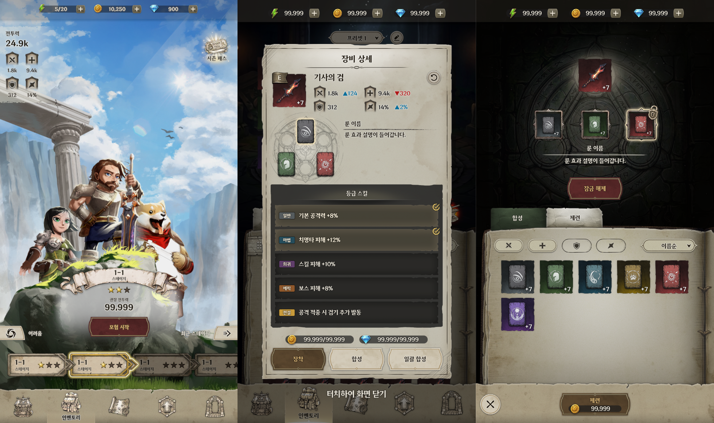
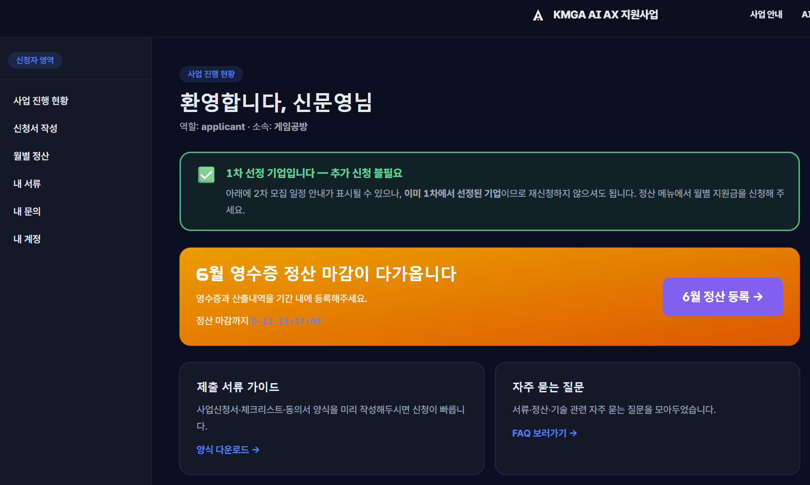
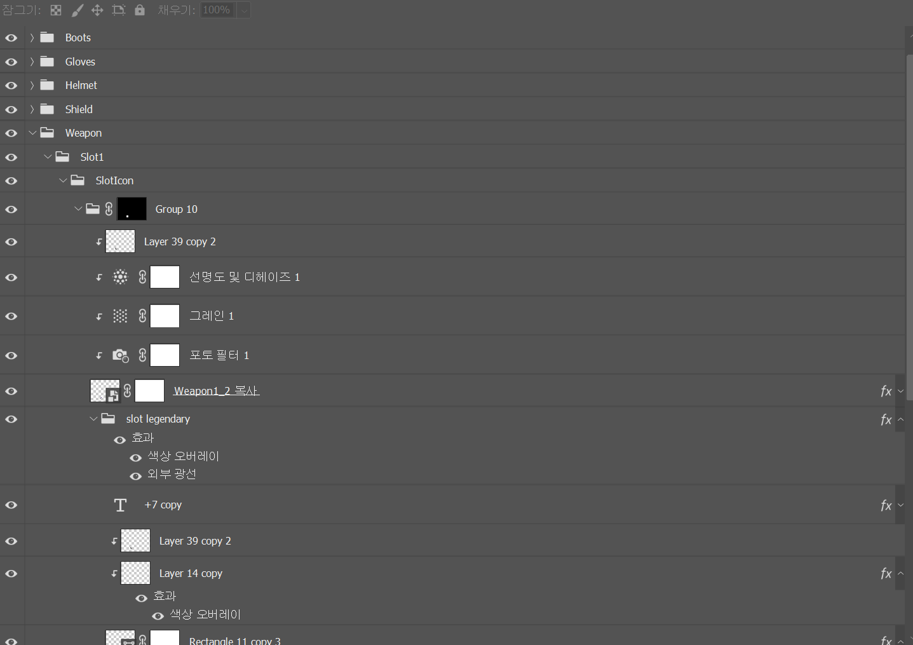

### UI 외주 마무리

나름 만족스럽게 마무리되었다. psd를 제공받았기 때문에 어느정도의 조정이 가능하다는 점이 고무적이다.
또 의외의 성과로는, 점점 포토샵 능력이 좋아지고 있다. 

---

### AX 지원사업 합격

뭔가 쓸 곳이 있을것이라는 강한 확신이 들어 신청했었는데, 정말이지 신청 안했으면 큰일날뻔 했다. 이유는 후술..
(뭔가 지원사업 사이트를 ai로 만든 느낌인데, 상당히 좋다. 뭔가 지원사업 특유의 뻣뻣한 그런게 없다. 테크놀로지아..) 

---

### 아이콘 작업

.png)

아이콘 작업은 많은 시행착오가 있었다. 사실 처음엔 감도 안잡혀서, 다 외주를 줘야 하나..? 하고 고민도 했었다. 우리 게임엔 무기,방패의 3d모델은 있었지만 타 장비는 없었기 때문에 난감한 상황이었기 때문이다.

그래서 **[gpt로 이미지 생성 -  3d모델 생성(Tripo3d, NC Varco) - 게임엔진에서 렌더링, 셰이더로 톤 잡기 - 포토샵으로 후처리 ]** 이 과정을 통해 아이콘들을 생성하기로 하였다. 물론 ai티가 안나냐 하면 그건 좀 애매하긴 한데,, 통일성은 확실히 좋아졌다.

기존에 없던 리소스, 있던 리소스 모두 해당 과정으로 새로 만들어주어 아이콘 통일성을 확보했다. 예를 들자면, 대검은 이미 3d 모델이 존재하지만 굳이 위 절차를 밟아 새로 만들어서 여타 아이콘과 같은 프로세스를 밟게 되고, 비슷한 톤앤매너를 가지게 된다. (원본 리소스를 사용했던 첫 시도에서는 알게 모르게 차이가 났다.)

당연하지만 며칠씩 시행착오를 거치면서 최종 단계까지 가도, 포토샵으로 후처리를 안해주니까 ui랑 안어울렸다. 어찌어찌 열심히 보정해서 ui랑 통일성을 갖추게 하긴 했다. 그래도 공부 많이 된다. 스트레스 많이 받을거야.

아티스트가 아니다보니 이 과정이 생각보다 오래 걸려, 거의 2.5일정도는 아이콘만 보고있었던것 같다.

---

### NC Varco VS Tripo 3D

 두 프로그램을 사용하면서 느낀 장단점을 적어보려 한다.

먼저, NC Varco의 장점은 인풋 텍스쳐 느낌을 아주 잘 살려준다는 것이다. 하이폴이던 로우폴이던 거의 그대로 옮겨준다.
특히 Stylized 스타일처럼 텍스쳐 느낌이 중요할 경우, 이는 압도적인 장점이다. 
다만 문제는, 이것 빼고 다 안좋다. 그러나 이 기능이 너무 압도적이어서 쓰지 않을수가 없다..

Tripo3D는 그 외 모든 면에서 압도적이다. 일단 리얼한 모델을 원할경우 단점이 없다. (텍스쳐의 페인팅 방식이 그다지 중요하지 않을경우, 쓰지 않을 이유가 없을 정도이다.)

메시 최적화, 툴 사용성, 오류 빈도 등등 그냥 압도적이다. 
다만, 텍스쳐 의도 반영 면에서 많이 떨어진다. 뭉게버리거나 그냥 비슷한 무언가가 나오는 느낌이 있다. 
어떤건 할때마다 잘되고, 어떤건 계속 해도 똑같이 안돼서 좀 답답할때가 있다.

3줄요약이다.

1. Stylized스타일을 희망하면 NC Varco
2. 그 이외의 스타일을 희망하면 Tripo 3D
3. 감사합니다.
