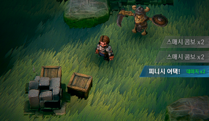
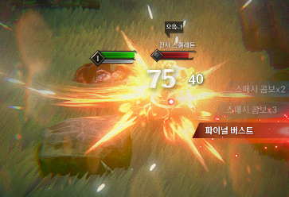

# 26.03 2주차 개발일지

[TOC]

---

### 개발환경 세팅

**[불필요한 프로그램 삭제]**

1. 어도비 계열 전부 삭제.
2. 언리얼 엔진, 에픽 런쳐 전부 삭제 
3. 휴지통 비우기 

**[드라이브 정리]**

1. 폴더 정리
2. APK 업로드 및 정리 - 아직 안끝남.

**[깃허브, 클로드 코드 연동]**

1. 깃허브와 [Asset_Important] 폴더 연동
2. 클로드 코드 연동 마무리.

---

### IngameTextBlock

### {: .left w="400" }

### {: .left w="400" }

대충 이런식으로 오른쪽에 공격 상태를 설명해주는 UI를 제작할 것이다.

**[동작 매커니즘 제작]**

**[ParticleImage 복제 플러그인 제작]**

**[이에 맞춰서 HeavyText 조정]**

**[액션 매커니즘 조정]**

---

### 기타 폴리싱

1. particle image를 skill에도 적용 

---

### 화산 맵 레벨 디자인

---

### 얼음 맵 레벨 디자인

