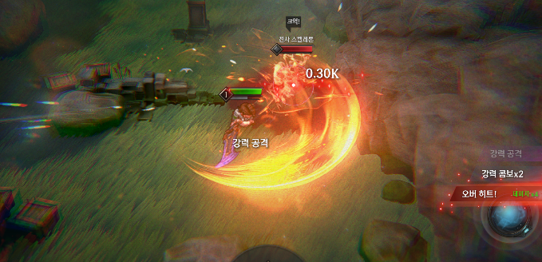
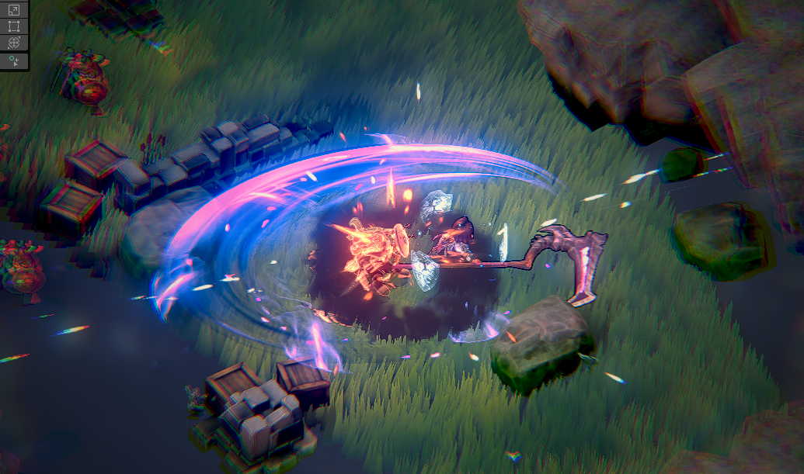
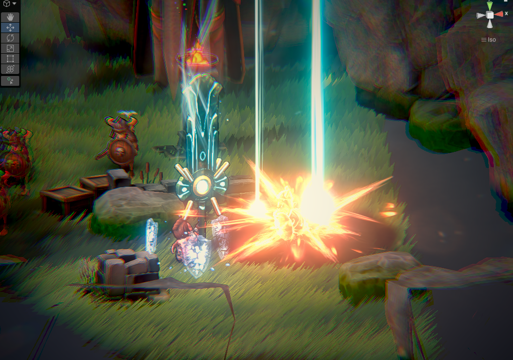

# 26.03 3주차 개발일지

[TOC]

---

### 액션 폴리싱

**[TargetPointer FX]**

### {: .left w="400" }

- 생각해보니, 이전 프로토타입에서 사용했던
  텍스트 이펙트가 상당히 좋았다. 게다가 이제 UI상에서 동작하니 선명하고,
  무엇보다 Atlas가 적용되어 드로우콜도 없을 것이다.
  다만, 배칭이 깨지지 않게 하기 위해 약간의 작업을 해야하긴 할 듯.

- 다만, 너무 난잡해져서 이 안건은 파기. 대신, 오버히트 상태를 강조할 필요를 느낌.
  그래서 TargetPointer에 오버히트 상태에서는 추가 효과가 나오도록 설정했다.

**[과한 이펙트 조정]**

1. Killable이펙트는 너무 과해서 삭제했다.

---

### 무기 제작

**[활 복구]**

### {: .left w="400" }

- 활 파티클 머티리얼 최적화를 진행해주었다. 
  SetPassCall 80 후반대에서 60대로 내려왔다. 
- 사용감도 건틀릿과 유사하도록 싹 조정해주었다.
- 활의 컨셉은, 막타 최강 샷건맨이다.
  막타는 어마어마하게 세지만 도달하는데 시간이 걸리고 느리고 후딜도 크다.
  2타까지는 무난하지만 데미지가 살짝 아쉽다. 그래서 2타까지 간보다가 3타 맞추는 컨셉.

**[대검 제작]**

어른의 사정으로 타이틀에 있는 대검이 없는게 참 아쉬웠다.
하나..만들어야겠지?

대검은 강공격이 많고 다수 타격에 용이하다. 그리고 타이틀에 있는 무기이니만큼 간지난다.
단점은 느리고 후딜이 크다는 것.

---

### 특수무기 리뉴얼

이전부터 좀 느낀거고 대검을 만들면서 확실시된것인데, 특수무기의 시각적 쾌감이 적다.
기존 무기들이 이미 충분히 멋있게 때리는데, 굳이 스킬을..? 이런 느낌이 시각적으로 느껴짐.

그래서 모두 전체 리뉴얼 작업을 하기로 하였다.

- **그리고, 이제 차지는 삭제된다.** 
  모바일 유저들에게는 차지도 어려운 조작일 수 있다는 걸 알게되었다.
- **무적 시각효과가 추가된다.**
  기존 어빌리티에서 사용되던 Guard 파티클을 사용해주었다.
- **초록 검, 붉은 도끼는 삭제된다.**
  대신, 데스사이스와 룬 검을 새로 제작해주었다.

**[데스사이스]**

일정 거리를 대쉬해서 벤다. 대쉬 판정이 강제이동이어서 구조물을 넘을 수 있다.
적 또한 넘어갈 수 있기 때문에 굉장히 다채롭다.

모션이 굉장히 간결하기 때문에 추후에는 쿨 초기화 효과를 줄 예정.
막 넘어다니며 써는 쾌감이 참 좋을것 같다.

다만, 그 과정에서 조금 버그가 생기기도 했다. Navmesh 조정이 필요.

**[룬 검]**

하늘을 향해 캐스팅을 하면 타겟에게 빛 세례를 발사한다.
거리에 상관없이 발동되기 때문에 편리하다.

---

### 최적화

1. fog 파티클을 하나로 통합 + 도넛 shape로 드로우콜 1로 줄임.
2. 렌턴 파티클 대폭 삭제.
3. 플레이어 안쓰는 파티클 임시 비활성화 (ex: shockwave)
4. 스킬 쓸때 drawcall 70대 유지하도록 함.
5. shake시 다이나믹 해상도 적용.
